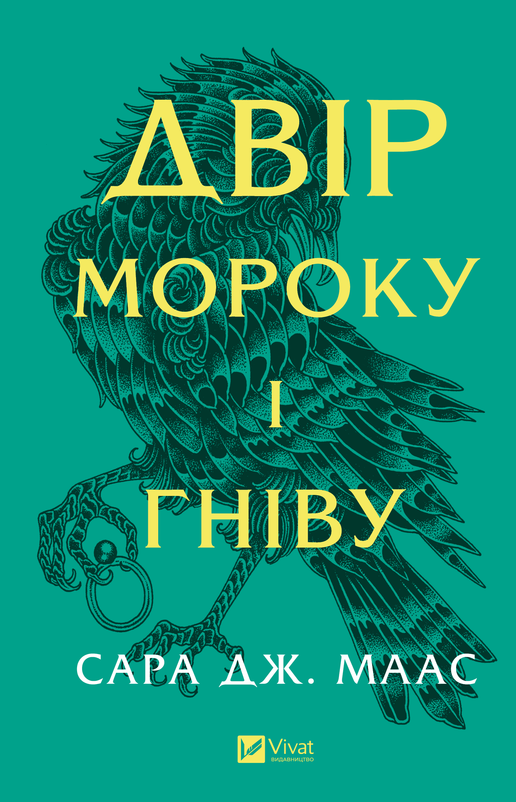

### Моя остання прочитана книга
---
> [!TIP]
_«Одні книги змушують нас мріяти, інші занурюють у дійсність, але всі вони пройняті найголовнішим для автора – щирістю»_

## Чому читати це круто?
1. *Розширює світогляд*

    Книги відкривають нові світи, культури, ідеї, досвід. Читаючи, ти можеш "пожити" тисячами життів, не виходячи з дому. 
1. *Розвиває мислення*

    Читання тренує мозок: логіку, аналітику, критичне мислення. Це як спортзал, тільки для розуму.
1. *Знімає стрес*

    Занурення в цікаву історію допомагає відволіктися від проблем. Це як медитація — тільки через сторінки.  

---
**Отже, моєю останньою прочитаю книгою є Двір Мороку і Гніву від авторки Сара Дж. Маас**

[Коротко про авторку можна прочитати за посиланням ]--> (https://uk.wikipedia.org/wiki/%D0%A1%D0%B0%D1%80%D0%B0_%D0%94%D0%B6%D0%B0%D0%BD%D0%B5%D1%82_%D0%9C%D0%B0%D0%B0%D1%81)

## Короткий опис сюжету книги
**Оскільки, Двір Мороку і Гніву є 2 частиною з 5 у ній продовжуються розгортатися події у фантистиному світі Фейрі, людей та дивовижних істот.**

**Головна героїня Фейра Арчеон рятує світ Фейрі від самопроголошеної королеви Амаранти, яка катувала фейрі та інших істот за Стіною від людей.
Під час своєї місії вона помирає та 7 лордів фейрі дарують їй частинку свого життя і вона перероджується отримуючи від кожного Лорда крихту їхньої сили.**

**Фейра старається продовжити жити, але нічні кошмари переслідують її місяцми та рана на серці не дає їй змоги прийняти реальність.**

**Та за допомогою своїх друзів вона вибирається з кокону жахів, але вона не знає що поререду її ще чекатимуть більші випробування.** 

---
# Головні герої:
+ Фейра Арчеон 
+ Різанд 
+ Мор
+ Амрен 
+ Темлін 
+ Люсюєн 

*Кожен персонаж особливий та авторка розповідає про них з кожною книною все більше і більше.*

___

 В кінці хочу додати, що особисто мені читання допомагає відволіктися та розслабитися. Читаю я багато жанрів, а саме: детективи, фентезі, романи, історичні та наукові. Найбільше надаю перевагу детективам