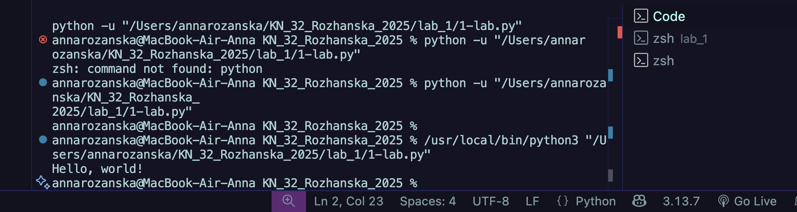
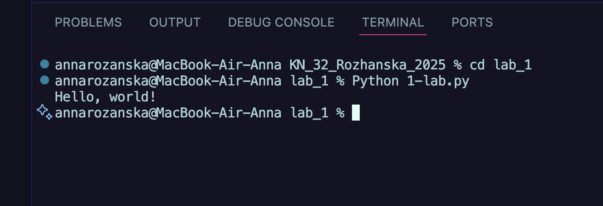
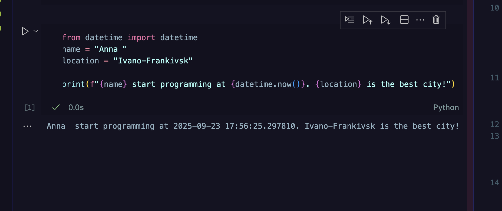

# Звіт до роботи
## Тема: _Вступні заняття: налаштування середовища, початок роботи з Python_
### Мета роботи: _Налаштувати середовище роботи VS Code, створити репозиторій Github та налаштувати інтеграцію з ним, написати першу програму на Python та створити звіт з використанням форматування Markdown_

---
### Виконання роботи
* Результати виконання завданнь: 

    1.Створили заготовку до звіту та перші файли Python для написання програм;
    1. Доінсталювали плагіни та почали працювати з VScode;
    1. Запитали в AI про першу програму

    - Запустили програму за допомогою Run 
    
    - Запусили програму з консолі
     

4.Зробили Ноутбук та запустили першу програму в комірках. Результати за посиланням [>>>посилання<<<](./note1.ipynb)

- *Вигляд виконаного коду*
    


* Попросили АІ згенерувати програму яка буде наступною:
 ```python
print("Скільки буде 5 + 7?")
answer = int(input("Ваша відповідь: "))
if answer == 12:
    print("Правильно!")
else:
    print("Неправильно. Правильна відповідь: 12")
```
- але ми поредагували код та зробили його кращим (результати у комірці [Ноутбука](./note.ipynb))


---
### Висновок:


- :question: Що зроблено в роботі;

*Налаштувала середовище, почала роботу з Python*
- :question: Чи досягнуто мети роботи;

*Так*
- :question: Які нові знання отримано;

*Оскільки, ніколи не працювала з Python дізналася як праильно налаштовувати середовище та інставалювала нові плагіни.*
- :question: Чи вдалось відповісти на всі питання задані в ході роботи;

*Так*
- :question: Чи вдалося виконати всі завдання;

*Так*
- :question: Чи виникли складності у виконанні завдання;

*Ні*
- :question: Чи подобається такий формат здачі роботи (Feedback);

*Та, не люблю робити звіти у GoogleDocument*
- :question: Побажання для покращення (Suggestions);

*Побажань не має*

---
## *Поставте ,будь ласка, 5 за виконання лаборатної роботи!*
