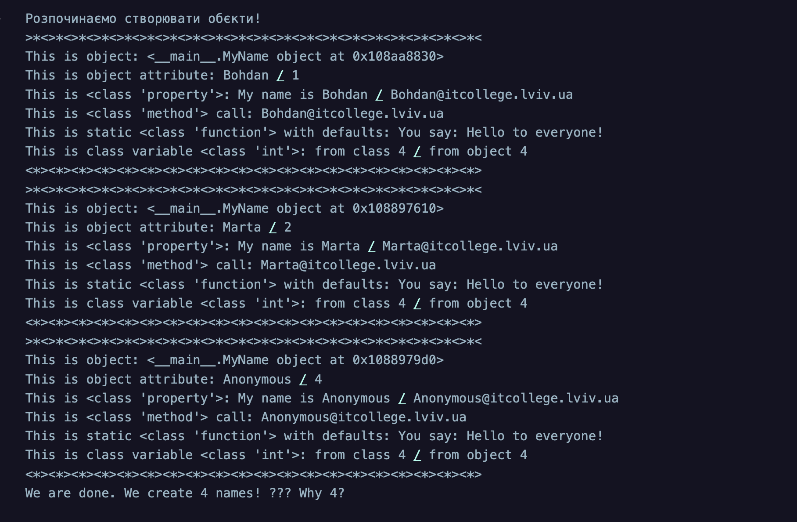
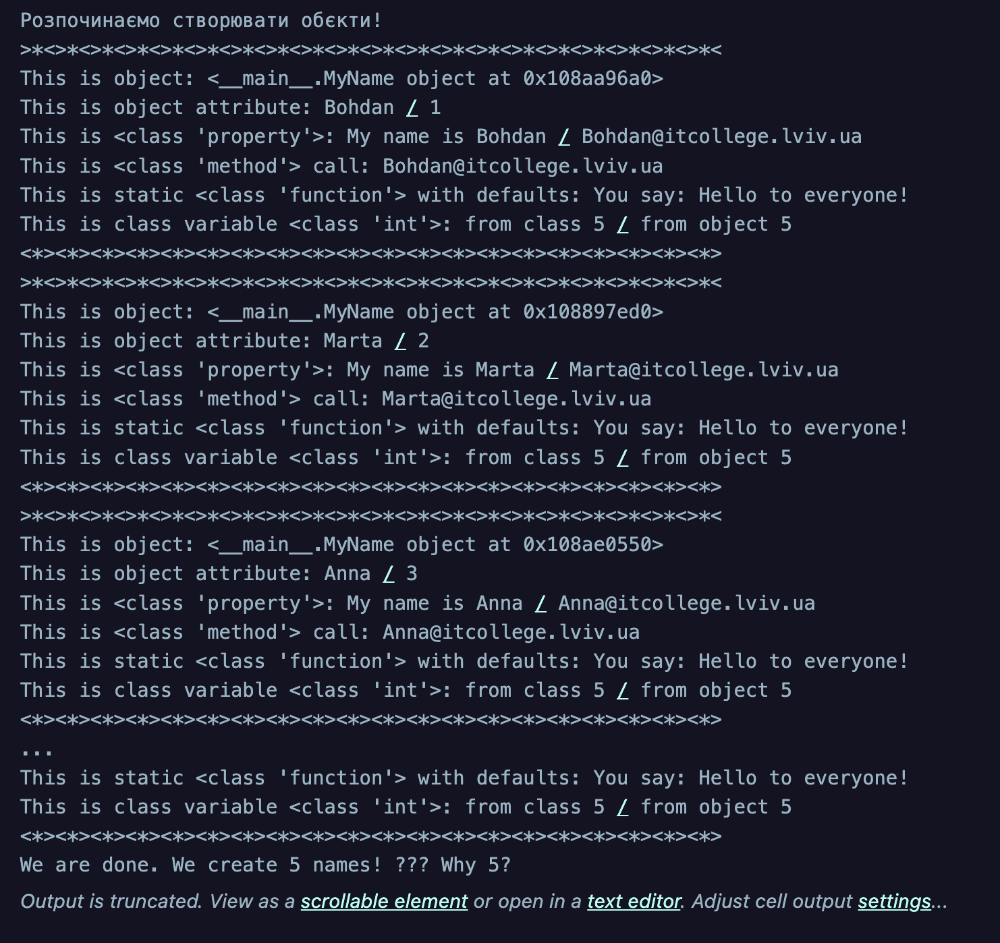

# Знайомство з ООП
## Мета роботи: __ Навчитись використовувати основні принципи ООП, розглянути кострукції побудови класу та створення обєктів та навчитись працювати з ними__


### Виконання роботи 
#### Створюємо перший class
1. Створила Python файл в якому буду виконувати завдання.
    [>>>URL на файл>>>>](./note.ipynb)


2. Скопіювала код наведений у завданні та отримала: 


3. Виконала приклад завдання з лекції

     [>>>URL на файл>>>>](./note.ipynb)

4. Модифікувала код наведенний у завадані додавши своє імʼя та отримала такиий результат

    


# Відповідь на запитання:

__Чому коли передаємо значення None створюється обєкт з іменем Anonymous?__

- Коли ми передаємо значення None, створюється об’єкт з ім’ям Anonymous, тому що в конструкторі __init__ прописана така умова

__Як змінити текст привітання при виклику методу say_hello()? Допишіть цю частину коду__

```python 
class MyName:
    """Опис класу / Документація
    """
    total_names = 0 #Class Variable

    def __init__(self, name=None) -> None:
        """Ініціалізація класу
        """
        self.name = name if name is not None else self.anonymous_user().name #Class attributes / Instance variables
        MyName.total_names += 1 #modify class variable
        self.my_id = self.total_names

    @property
    def whoami(self) -> str: 
        """Class property
        return: повертаємо імя 
        """
        return f"My name is {self.name}"
    
    @property
    def my_email(self) -> str:
        """Class property
        return: повертаємо емейл
        """
        return self.create_email()
    
    def create_email(self) -> str:
        """Instance method
        """
        return f"{self.name}@itcollege.lviv.ua"

    @classmethod
    def anonymous_user(cls):
        """Classs method
        """
        return cls("Anonymous")
    
    @staticmethod
    def say_hello(message="Hello to everyone!") -> str:
        """Static method
        """
        return f"You say: {message}"


print("Розпочинаємо створювати обєкти!")

names = ("Bohdan", "Marta", "Anna", None)
all_names = {name: MyName(name) for name in names}

for name, me in all_names.items():
    print(f"""{">*<"*20}
This is object: {me} 
This is object attribute: {me.name} / {me.my_id}
This is {type(MyName.whoami)}: {me.whoami} / {me.my_email}
This is {type(me.create_email)} call: {me.create_email()}
This is static {type(MyName.say_hello)} with defaults: {me.say_hello()} 
This is static {type(MyName.say_hello)} custom message: {me.say_hello('Привіт! Це кастомне привітання!')}
This is class variable {type(MyName.total_names)}: from class {MyName.total_names} / from object {me.total_names}
{"<*>"*20}""")

print(f"We are done. We create {me.total_names} names! ??? Why {MyName.total_names}?")
```


__Допиcала функцію в класі яка порахує кількість букв імені__
```python 
class MyName:
    """Опис класу / Документація
    """
    total_names = 0  # Class Variable

    def __init__(self, name=None) -> None:
        """Ініціалізація класу
        """
        self.name = name if name is not None else self.anonymous_user().name
        MyName.total_names += 1  # modify class variable
        self.my_id = self.total_names

    @property
    def whoami(self) -> str:
        """Class property: повертаємо імʼя"""
        return f"My name is {self.name}"

    @property
    def my_email(self) -> str:
        """Class property: повертаємо емейл"""
        return self.create_email()

    def create_email(self) -> str:
        """Instance method"""
        return f"{self.name}@itcollege.lviv.ua"

    @classmethod
    def anonymous_user(cls):
        """Class method"""
        return cls("Anonymous")

    @staticmethod
    def say_hello(message="Hello to everyone!") -> str:
        """Static method"""
        return f"You say: {message}"

    def name_length(self) -> int:
        """Порахувати кількість букв у імені"""
        return len(self.name)


print("Розпочинаємо створювати обʼєкти!")

names = ("Bohdan", "Marta", "Anna", None)
all_names = {name: MyName(name) for name in names}

for name, me in all_names.items():
    print(f"""{">*<"*20}
This is object: {me} 
This is object attribute: {me.name} / {me.my_id}
This is {type(MyName.whoami)}: {me.whoami} / {me.my_email}
This is {type(me.create_email)} call: {me.create_email()}
This is static {type(MyName.say_hello)} with defaults: {me.say_hello()}
This is static {type(MyName.say_hello)} custom message: {me.say_hello('Привіт! Це кастомне привітання!')}
Letters in name: {me.name_length()}
This is class variable {type(MyName.total_names)}: from class {MyName.total_names} / from object {me.total_names}
{"<*>"*20}""")

print(f"We are done. We create {me.total_names} names! ??? Why {MyName.total_names}?")
``` 

__Порахувала кількість імен у списку names та порівняла із виведеним результатом__

``` python 
class MyName:
    """Опис класу / Документація
    """
    total_names = 0  # Class Variable

    def __init__(self, name=None) -> None:
        """Ініціалізація класу"""
        self.name = name if name is not None else "Anonymous"  # тепер без створення нового об’єкта
        MyName.total_names += 1
        self.my_id = self.total_names

    @property
    def whoami(self) -> str:
        return f"My name is {self.name}"

    @property
    def my_email(self) -> str:
        return self.create_email()

    def create_email(self) -> str:
        return f"{self.name}@itcollege.lviv.ua"

    @staticmethod
    def say_hello(message="Hello to everyone!") -> str:
        return f"You say: {message}"

    def name_length(self) -> int:
        """Порахувати кількість букв у імені"""
        return len(self.name)


print("Розпочинаємо створювати обʼєкти!")

names = ("Bohdan", "Marta", "Anna", None)
all_names = {name: MyName(name) for name in names}

for name, me in all_names.items():
    print(f"""{">*<"*20}
This is object: {me} 
This is object attribute: {me.name} / {me.my_id}
This is {type(MyName.whoami)}: {me.whoami} / {me.my_email}
This is {type(me.create_email)} call: {me.create_email()}
This is static default: {me.say_hello()}
This is static custom: {me.say_hello('Привіт! Це кастомне привітання!')}
Letters in name: {me.name_length()}
This is class variable: from class {MyName.total_names} / from object {me.total_names}
{"<*>"*20}""")

# Рахуємо кількість імен у списку
count_in_list = len(names)

print(f"Кількість імен у списку names: {count_in_list}")
print(f"Кількість створених обʼєктів MyName: {MyName.total_names}")

print("\nВсі кількості співпадають, бо для None тепер не створюється додатковий об’єкт.")
```


__Модифікувала конструктор init, щоб значення self.name завжди починалося з великої літери, навіть якщо користувач ввів маленьку__
``` python 
class MyName:
    """Опис класу / Документація
    """
    total_names = 0  # Class Variable

    def __init__(self, name=None) -> None:
        """Ініціалізація класу: імʼя завжди з великої літери"""
        self.name = (name if name is not None else "Anonymous").capitalize()
        MyName.total_names += 1
        self.my_id = MyName.total_names

    @property
    def whoami(self) -> str:
        return f"My name is {self.name}"

    @property
    def my_email(self) -> str:
        return self.create_email()

    def create_email(self) -> str:
        return f"{self.name}@itcollege.lviv.ua"

    @staticmethod
    def say_hello(message="Hello to everyone!") -> str:
        return f"You say: {message}"

    def name_length(self) -> int:
        """Порахувати кількість букв у імені"""
        return len(self.name)


# Тестування
names = ("bohdan", "marta", "anna", None)
all_names = {name: MyName(name) for name in names}

for name, me in all_names.items():
    print(f"{me.name} / Letters: {me.name_length()}")
```


__Змінила метод create_email так щоб можна було модифікувати значення після @;__


```python
class MyName:
    total_names = 0  # Class Variable

    def __init__(self, name=None) -> None:
        """Ініціалізація класу без зміни регістру"""
        self.name = name if name is not None else "Anonymous"
        MyName.total_names += 1
        self.my_id = MyName.total_names

    @property
    def whoami(self) -> str:
        return f"My name is {self.name}"

    @property
    def my_email(self) -> str:
        return self.create_email()  # за замовчуванням

    def create_email(self, domain="itcollege.lviv.ua") -> str:
        """Instance method: можна змінити домен після @"""
        return f"{self.name}@{domain}"

    @staticmethod
    def say_hello(message="Hello to everyone!") -> str:
        return f"You say: {message}"

    def name_length(self) -> int:
        """Порахувати кількість букв у імені"""
        return len(self.name)
```

__Додала перевірку: якщо ім’я містить цифри або символи, піднімається помилка___

    <<<ValueError("Ім'я може містити лише літери!").>>>

```python 
class MyName:
    total_names = 0  # Class Variable

    def __init__(self, name=None) -> None:
        """Ініціалізація класу з перевіркою імені"""
        self.name = name if name is not None else "Anonymous"

        # Перевірка: ім'я повинно містити лише літери
        if not self.name.isalpha():
            raise ValueError("Ім'я може містити лише літери!")

        MyName.total_names += 1
        self.my_id = MyName.total_names

    @property
    def whoami(self) -> str:
        return f"My name is {self.name}"

    @property
    def my_email(self) -> str:
        return self.create_email()  # за замовчуванням

    def create_email(self, domain="itcollege.lviv.ua") -> str:
        """Instance method: можна змінити домен після @"""
        return f"{self.name}@{domain}"

    @staticmethod
    def say_hello(message="Hello to everyone!") -> str:
        return f"You say: {message}"

    def name_length(self) -> int:
        """Порахувати кількість букв у імені"""
        return len(self.name)


print("Розпочинаємо створювати обʼєкти!")

names = ("Bohdan", "Marta", "Anna123", "Anna", None)
all_names = {}

for n in names:
    try:
        person = MyName(n)
        all_names[n] = person
        print(f"""{">*<"*20}
This is object: {person} 
This is object attribute: {person.name} / {person.my_id}
This is {type(MyName.whoami)}: {person.whoami} / {person.my_email}
This is {type(person.create_email)} call: {person.create_email()}
This is custom domain: {person.create_email('gmail.com')}
This is static default: {person.say_hello()}
This is static custom: {person.say_hello('Привіт! Це кастомне привітання!')}
Letters in name: {person.name_length()}
This is class variable: from class {MyName.total_names} / from object {person.total_names}
{"<*>"*20}""")
    except ValueError as e:
        # Тут буде саме ValueError("Ім'я може містити лише літери!")
        print(f"Помилка для '{n}': {e}")
```


__Додайте нову властивість full_name, яка повертає результат у форматі:__

    "User #<id>: <name> (<email>)"


``` python
class MyName:
    total_names = 0  # Class Variable

    def __init__(self, name=None) -> None:
        """Ініціалізація класу з перевіркою імені"""
        self.name = name if name is not None else "Anonymous"

        # Перевірка: ім'я повинно містити лише літери
        if not self.name.isalpha():
            raise ValueError("Ім'я може містити лише літери!")

        MyName.total_names += 1
        self.my_id = MyName.total_names

    @property
    def whoami(self) -> str:
        return f"My name is {self.name}"

    @property
    def my_email(self) -> str:
        return self.create_email()

    def create_email(self, domain="itcollege.lviv.ua") -> str:
        """Instance method: можна змінити домен після @"""
        return f"{self.name}@{domain}"

    @staticmethod
    def say_hello(message="Hello to everyone!") -> str:
        return f"You say: {message}"

    def name_length(self) -> int:
        """Порахувати кількість букв у імені"""
        return len(self.name)

    @property
    def full_name(self) -> str:
        """Повертає рядок у форматі 'User #<id>: <name> (<email>)'"""
        return f"User #{self.my_id}: {self.name} ({self.my_email})"


# Приклад print
person = MyName("Anna")
print(person.full_name)
```

__реалізуйте метод save_to_file(filename="users.txt"), який додає рядок із записом у файл;__


```python
class MyName:
    total_names = 0  # Class Variable

    def __init__(self, name=None) -> None:
        """Ініціалізація класу з перевіркою імені"""
        self.name = name if name is not None else "Anonymous"

        # Перевірка: ім'я повинно містити лише літери
        if not self.name.isalpha():
            raise ValueError("Ім'я може містити лише літери!")

        MyName.total_names += 1
        self.my_id = MyName.total_names

    @property
    def whoami(self) -> str:
        return f"My name is {self.name}"

    @property
    def my_email(self) -> str:
        return self.create_email()

    @property
    def full_name(self) -> str:
        """Повертає рядок у форматі 'User #<id>: <name> (<email>)'"""
        return f"User #{self.my_id}: {self.name} ({self.my_email})"

    def create_email(self, domain="itcollege.lviv.ua") -> str:
        """Instance method: можна змінити домен після @"""
        return f"{self.name}@{domain}"

    @staticmethod
    def say_hello(message="Hello to everyone!") -> str:
        return f"You say: {message}"

    def name_length(self) -> int:
        """Порахувати кількість букв у імені"""
        return len(self.name)

    def save_to_file(self, filename="users.txt"):
        """Додає рядок із інформацією користувача у файл"""
        with open(filename, "a", encoding="utf-8") as f:
            f.write(self.full_name + "\n")


person = MyName("Anna")

print(f"This is object: {person}")
print(f"This is object attribute: {person.name} / {person.my_id}")
print(f"This is whoami: {person.whoami} / {person.my_email}")
print(f"This is create_email call: {person.create_email()}")
print(f"This is custom domain email: {person.create_email('gmail.com')}")
print(f"This is static default: {person.say_hello()}")
print(f"This is static custom: {person.say_hello('Привіт! Це кастомне привітання!')}")
print(f"Letters in name: {person.name_length()}")
print(f"This is class variable: from class {MyName.total_names} / from object {person.total_names}")
print(f"Full name: {person.full_name}")

# Збереження у файл
person.save_to_file()  # За замовчуванням у users.txt
person.save_to_file("custom_users.txt")  # Додатково у custom_users.txt
```

# Висновок 
❓ Що зроблено в роботі;

Навчилася використовувати основні принципи ООП, розглянула кострукції побудови класу та створення обєктів та навчилася працювати з ними

❓ Чи досягнуто мети роботи;

так 

❓ Які нові знання отримано;

Зробила першу програму на ООП

❓ Чи вдалось відповісти на всі питання задані в ході роботи;

так 

❓ Чи вдалося виконати всі завдання;

так 

❓ Чи виникли складності у виконанні завдання;

ні 

❓ Чи подобається такий формат здачі роботи (Feedback);

так, все зручно 

❓ Побажання для покращення (Suggestions);

ні, не має 


