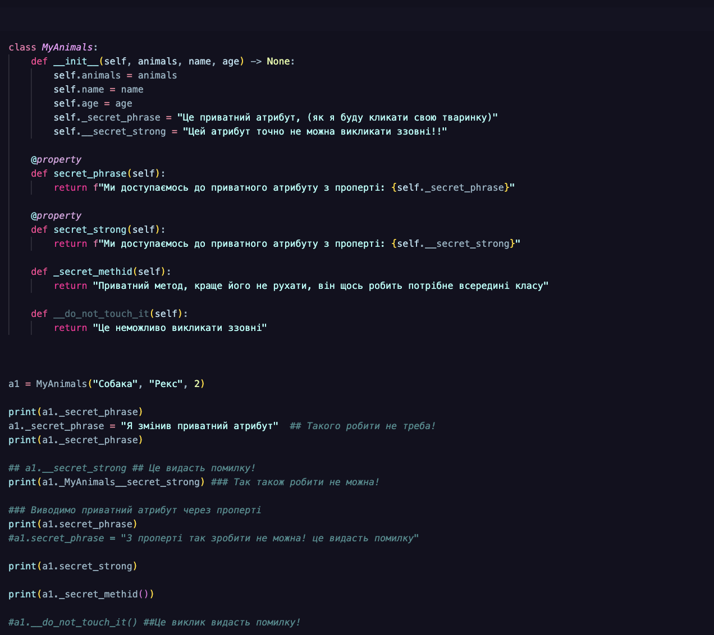
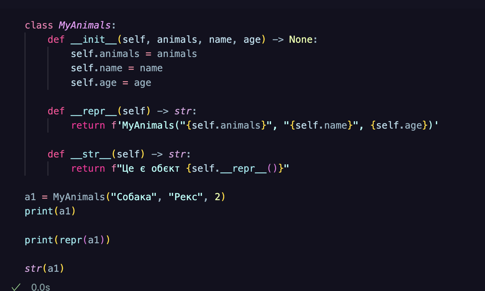
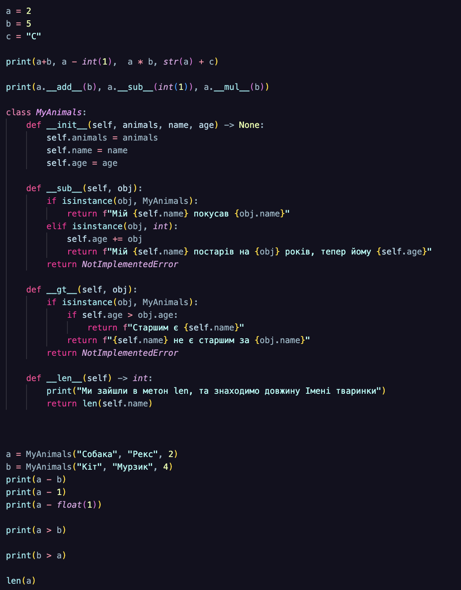

# Робота з ООП
## Мета роботи: __Навчитись працювати з Класами та його основними конструкціями__

### Виконання роботи 
- Відкрила файл із завданнями та виконала їх, перед тим створивши файл note.ipynb
[<<<URL на файл >>>](./note.ipynb)

# Короткий опис виконаних завдань 
1. 

__Приватні атрибути та методи__

У наданому коді на Python були продемонстровані принципи інкапсуляції та використання  @property для контрольованого доступу до атрибутів класу. 

2. 

__Магічні методи__

У цьому коді на Python визначено простий клас MyAnimals, який має методи __init__, __repr__ та __str__ для ініціалізації об'єкта та визначення його текстового представлення

3. 

__Арифметичні методи__

У наданому коді на Python був визначений клас MyAnimals, який демонструє перевантаження операторів за допомогою спеціальних методів, таких як __sub__ (віднімання), __gt__ (більше ніж) та __len__ (довжина). Ці методи дозволяють виконувати операції віднімання, порівняння та отримання довжини безпосередньо з об'єктами цього класу.

# Висновок 
❓ Що зроблено в роботі;

Навчилася працювати з Класами та його основними конструкціями

❓ Чи досягнуто мети роботи;

так 

❓ Які нові знання отримано;

Закріпила вивчений матеріал

❓ Чи вдалось відповісти на всі питання задані в ході роботи;

так 

❓ Чи вдалося виконати всі завдання;

так 

❓ Чи виникли складності у виконанні завдання;

ні 

❓ Чи подобається такий формат здачі роботи (Feedback);

так, все зручно 

❓ Побажання для покращення (Suggestions);

ні, все окей 

