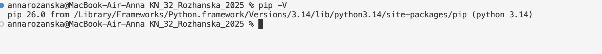
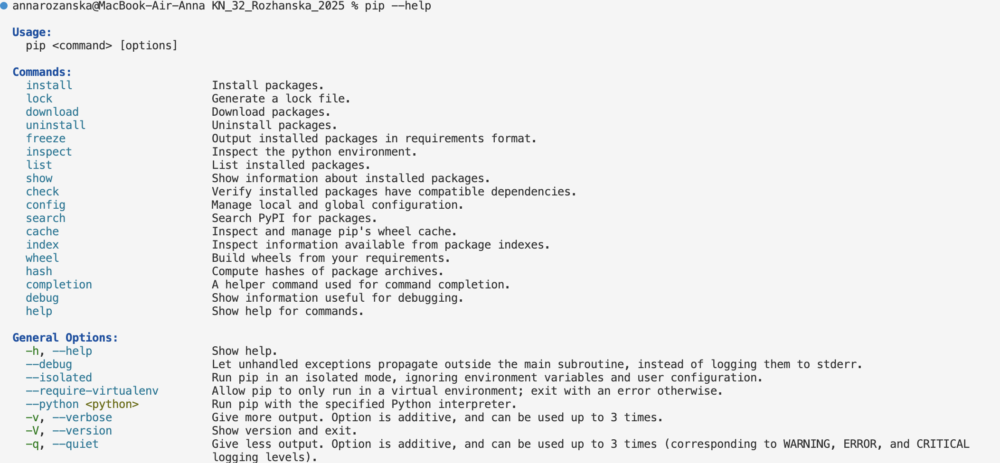
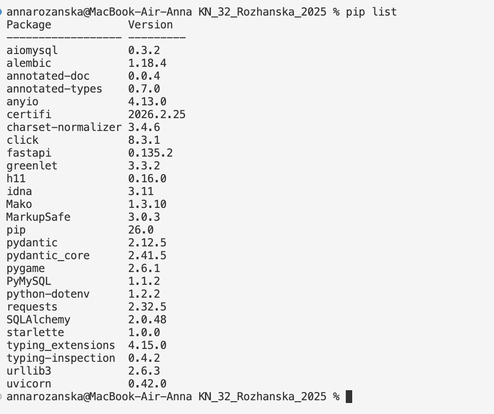
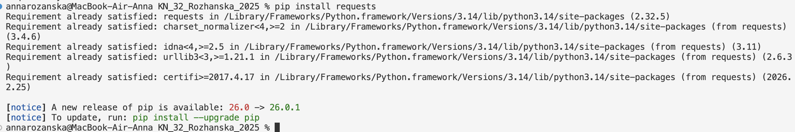
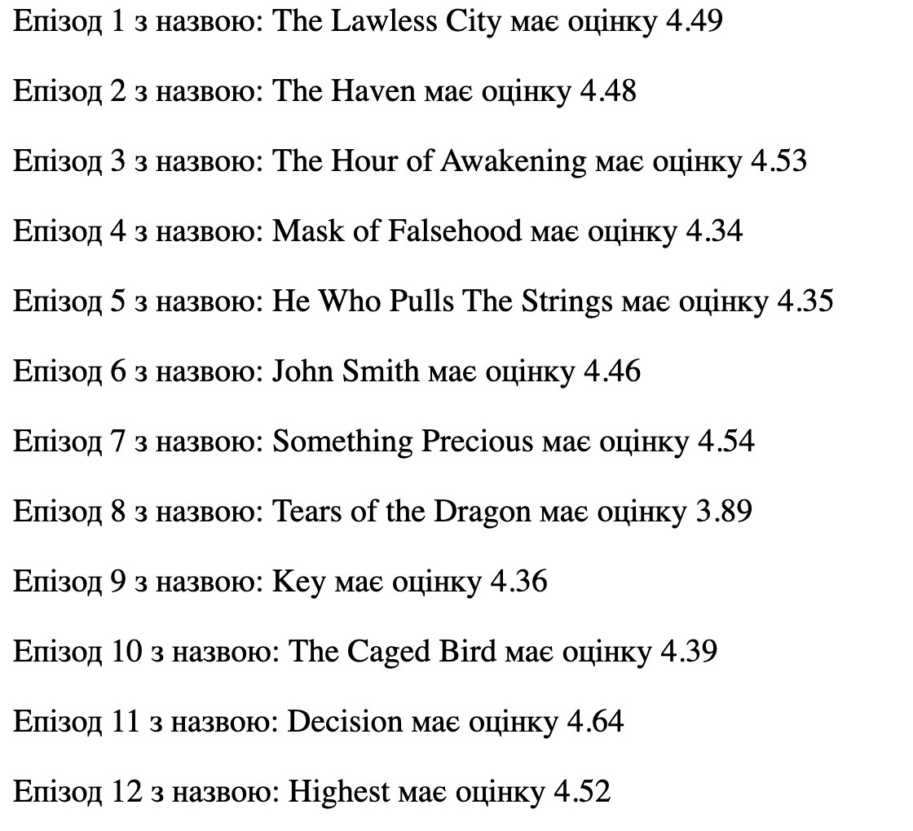
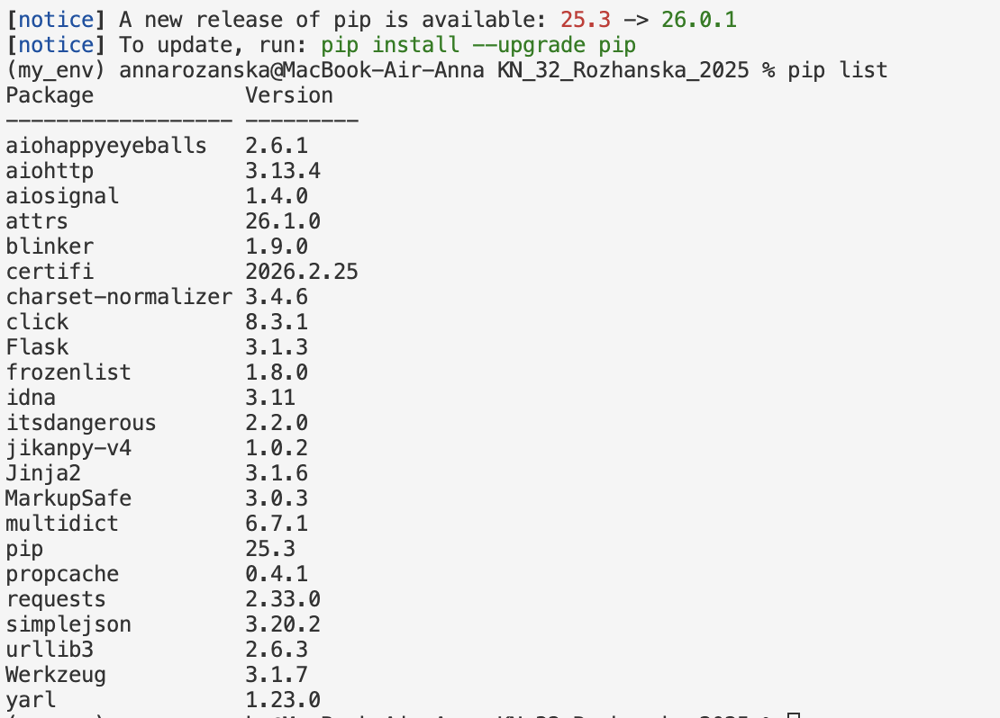
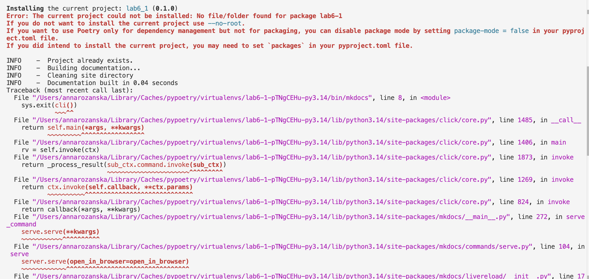

 # Віртуальні середовища
## Мета роботи: __Ізольовані віртуальні середовища - це сукупність Python інтерпретатора, бібліотек та скриптів ізольована від інших інсталяцій. Віртуальні середовища в Python дозволяють створювати ізольовані простори для проєктів, забезпечуючи незалежність від глобальних налаштувань та залежностей. Це особливо корисно при роботі з різними проєктами, які можуть вимагати різних версій бібліотек.__

### Виконання роботи 
1. Створила Python файл в якому буду виконувати завдання.
    [>>>URL на файл>>>>](./note.ipynb)
2. Встановлюю pip на мій пк

3. Виконала команаду pip help

4. Перевірила які бібліотеки вже інстальовані за допомогою pip list 

5. Завантажила бібліотеку pip install requests


```python
>>> import requests
>>> requests.__version__
'2.32.5'
>>> r = requests.get('https://google.com')
>>> r.status_code
200
>>> exit()
```
6. Встановила дану бібліотеку pip install jikanpy-v4 Flask
7. Створила та запустила файл anime.py 
    [>>>URL на файл>>>>](./anime.py)
    - Ось результат 
    
8. Результат команд 

 ```python
>>> python -m venv ./my_env
>>> source my_env/bin/activate
>>> pip install jikanpy-v4 Flask

>>> pip freeze > requirements.txt

__Після перевстановлення середовища потрібно встановити всі залежності, які описані в requirements.txt__
pip install -r requirements.txt

>>> python -m venv ./my_env && source my_env/bin/activate && pip install -r requirements.txt
>>> pip list
>>> deactivate

```



9. Зʼявилися проблеми з документацію за допомогою MkDocs



---
### Висновок:


-  :question: Що зроблено в роботі;

*Віртуальні середовища*
- :question: Чи досягнуто мети роботи;

*Ні, виникли труднощі з MkDocs*
- :question: Які нові знання отримано;

*Дізналася про ізольовані середовищі*
- :question: Чи вдалось відповісти на всі питання задані в ході роботи;

*Ні*
- :question: Чи вдалося виконати всі завдання;

*Ні*
- :question: Чи виникли складності у виконанні завдання;

*Так*
- :question: Чи подобається такий формат здачі роботи (Feedback);

*Так*
- :question: Побажання для покращення (Suggestions);

*Побажань не має*

---


