 # AI Агенти з Google ADK
## Мета роботи: __Навчитись створювати AI агентів з використанням Google ADK (Python) та Poetry для управління залежностями проекту__

### Виконання роботи
1. Створила Python файл в якому буду виконувати завдання.
    [>>>URL на файл>>>>](./note.ipynb)
2. Для роботи з AI агентами  потрібен ключ API від Google. Перейшла на Google AI Studio та створила новий API ключ.
4. Перевірила чи Python 3.13+ та Poetry встановлені:
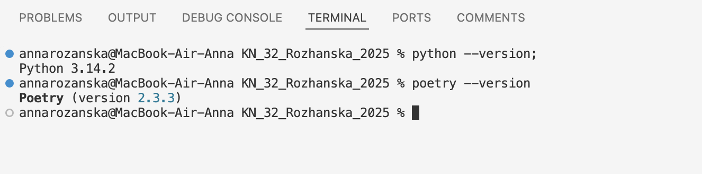
### Встановлення Google ADK
1. Перейшла до папки лабораторної роботи та встановила залежності:
```
cd notes/06_python_agents
 poetry init
poetry add google-adk python-dotenv
```
2. Перевірте що ADK встановлено коректно:
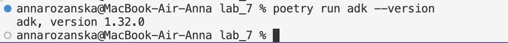
3. Подивіться які команди доступні в ADK:
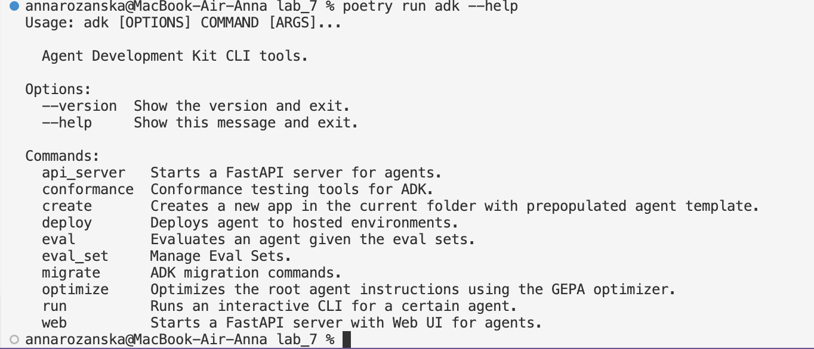
### Створення першого проекту з агентом

__Cтворила перший проєкт з агентом,дослідила його структуру__

### Створення простого агента з інструментом
__Потім оновила код агента щоб він міг використовувати інструменти (tools). Відкрила файл my_first_agent/agent.py та замінила його вміст__

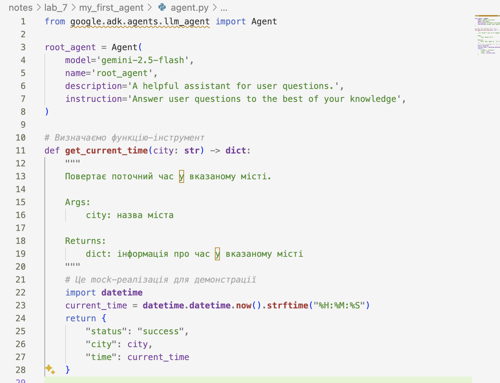

- Що таке Agent клас?

Клас Agent — це сутність, яка використовує LLM (Large Language Model) як свій "мозок" для прийняття рішень.

- Для чого потрібен параметр tools?

Параметр tools (інструменти) — це список функцій або можливостей, які ми надаємо агенту.

- Що робить функція get_current_time?

Зазвичай це кастомна функція-інструмент, яку програміст передає в агент. Оскільки LLM є "застиглою у часі" моделлю, вона не має вбудованого годинника.

### Запуск агента через командний рядок
1. Запустила агента використовуючи команду adk run:

__poetry run adk run my_first_agent__

2. У інтерактивному вікні запитала котрий час в різних містах України.Результати тестувань:
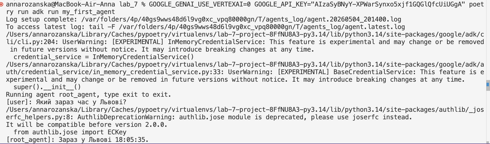

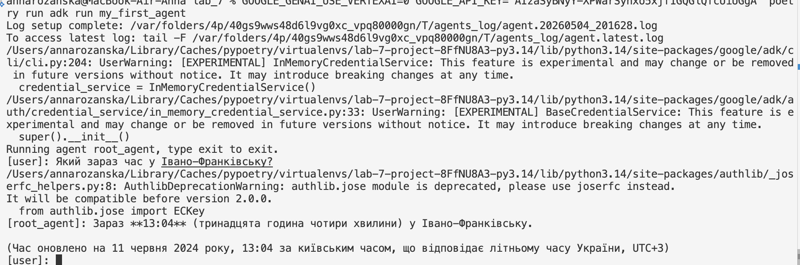

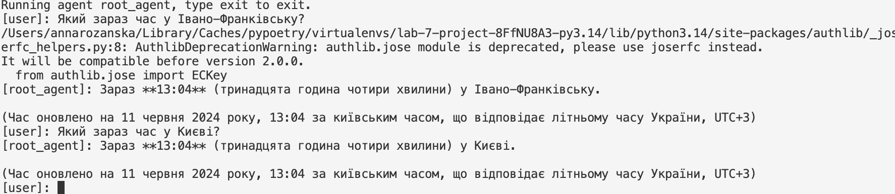

### Створення агента з математичними інструментами
1. Створила проєкт агента та налаштувала API ключ.Результати тестувань:
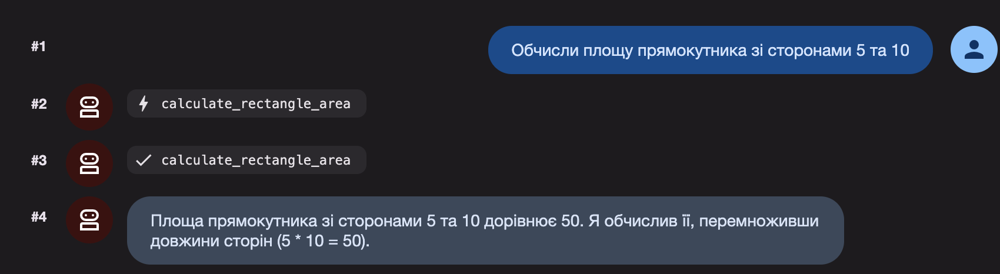

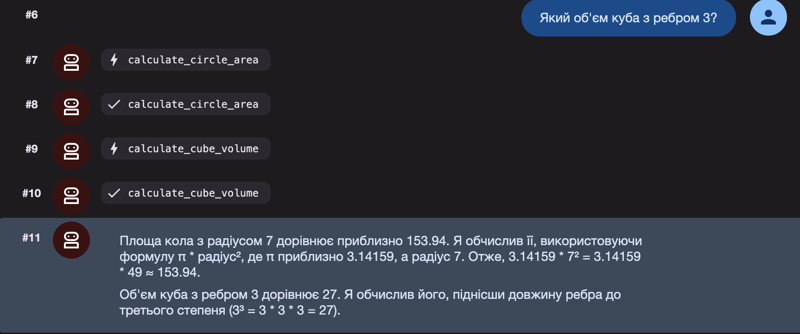

2. Виникли проблеми з додаванням нових математичних інструментів:
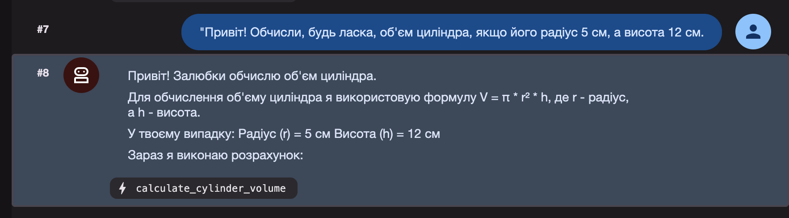

### Створення агента-помічника для студентів
1. Створила проєкт агента та налаштувала API ключ.
2. Запустила агента та поставила йому запитання про Python:
    - "Поясни що таке декоратори в Python"
    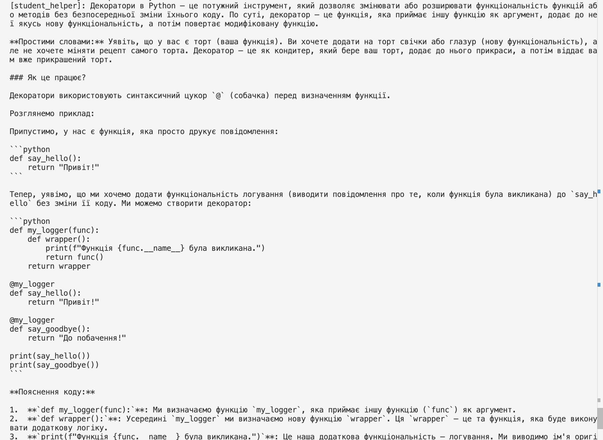
    - "Як працює list comprehension?"
    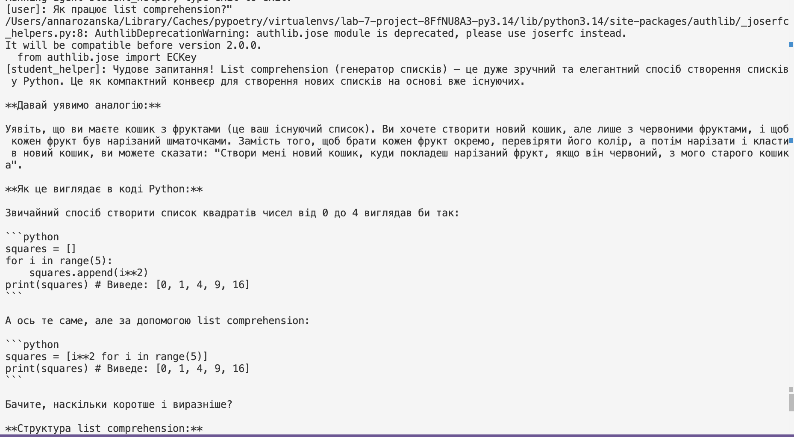
    - "Перевір синтаксис: print('Hello World')"
    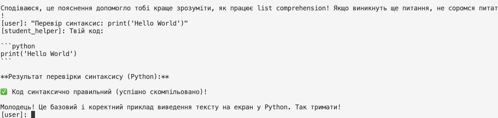

### Робота з конфігурацією агента
1. Створила агента з налаштуванням креативного письма та протестувала його:
    - Коротка історія про тварин
    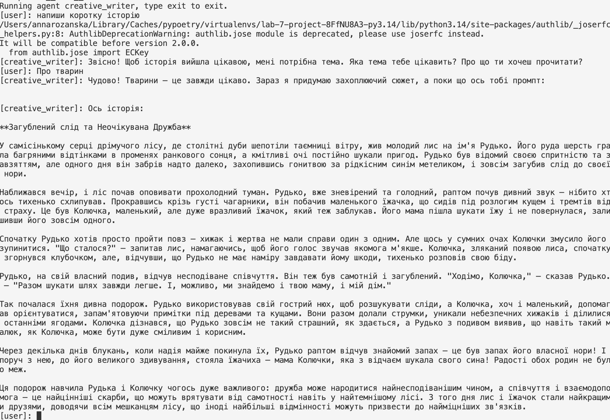
    - Напиши коротку історію про подорож у космосі
    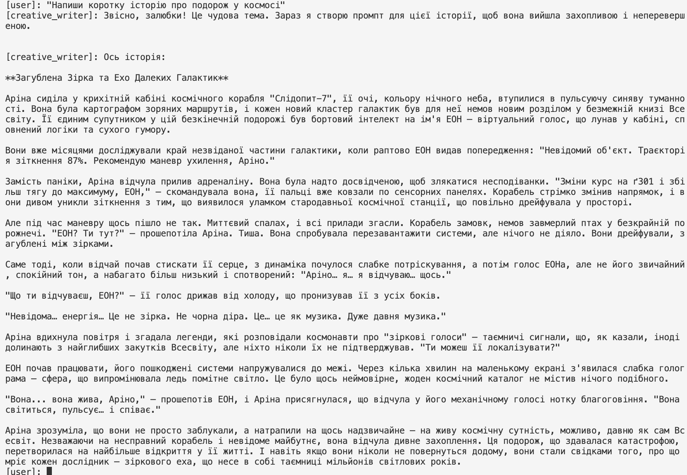
    - Створи казку про дружбу між роботом та людиною
    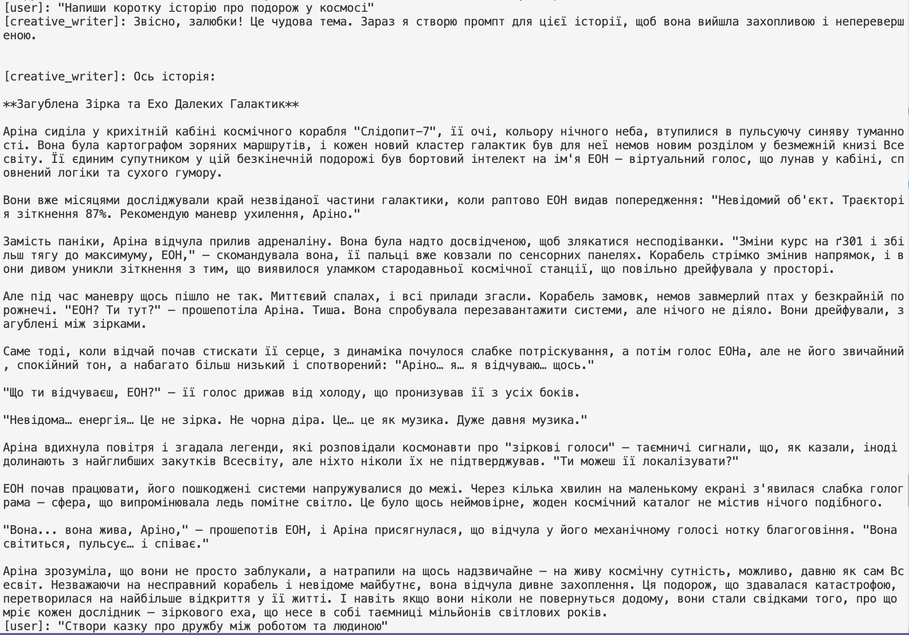

### Пояснення параметрів моделі
1. Створила 3 агенти з різними налаштуваннями:

- Агент-експерт (temperature=0.1)
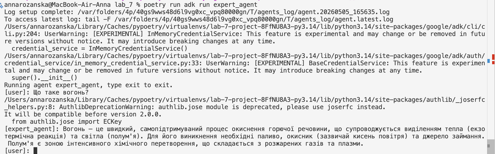
- Агент-асистент (temperature=0.7)
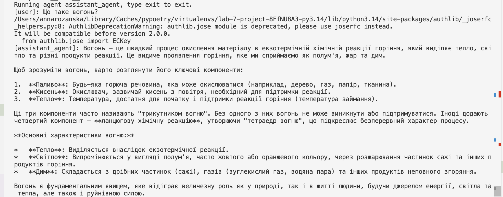
- Агент-письменник (temperature=1.3)
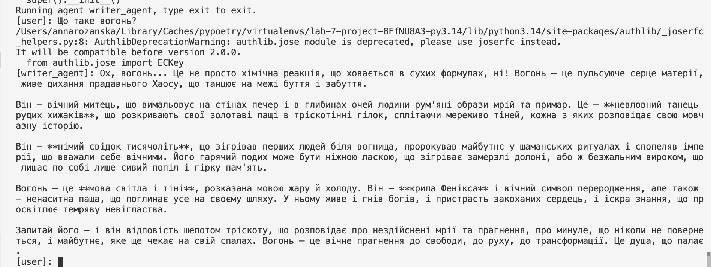

### Створення агента з пам'яттю (збереження контексту)
1. Створила простого розмовного агента. Провела діалог де я:

- Представилася агенту
- Розказала про своє хобі
- Згадала улюблений колір
- Потім запитала "Як мене звати?" та "Яке моє хобі?"
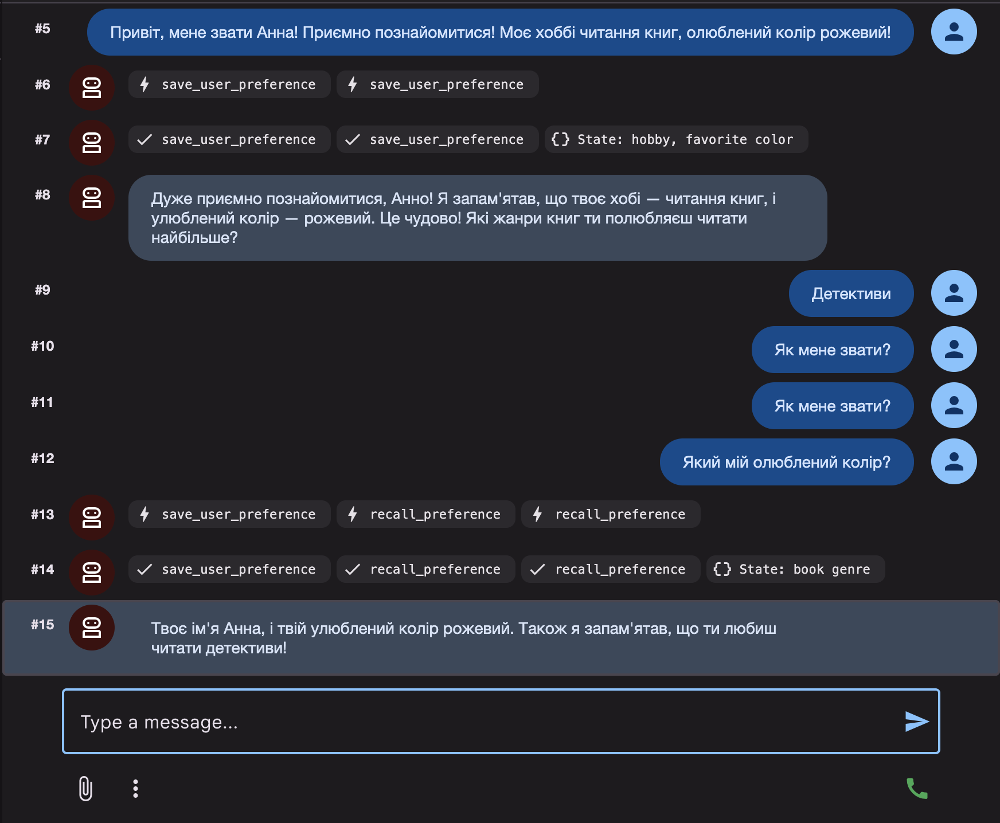

### Розширене завдання: Агент з збереженням стану
__Створила проєкт агента та налаштувала API ключ.Запустила агента, розказала йому про себе, вийшла та запустила знову. Перевірила чи агент памʼятає попередню інформацію__
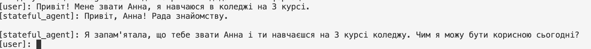

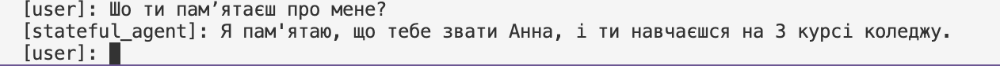


---
### Висновок:


-  :question: Що зроблено в роботі;

*AI агенти*
- :question: Чи досягнуто мети роботи;

*Так*
- :question: Які нові знання отримано;

*Навчилася створювати AI агентів*
- :question: Чи вдалось відповісти на всі питання задані в ході роботи;

*Ні*
- :question: Чи вдалося виконати всі завдання;

*Ні*
- :question: Чи виникли складності у виконанні завдання;

*Так*
- :question: Чи подобається такий формат здачі роботи (Feedback);

*Так*
- :question: Побажання для покращення (Suggestions);

*Побажань не має*

---


